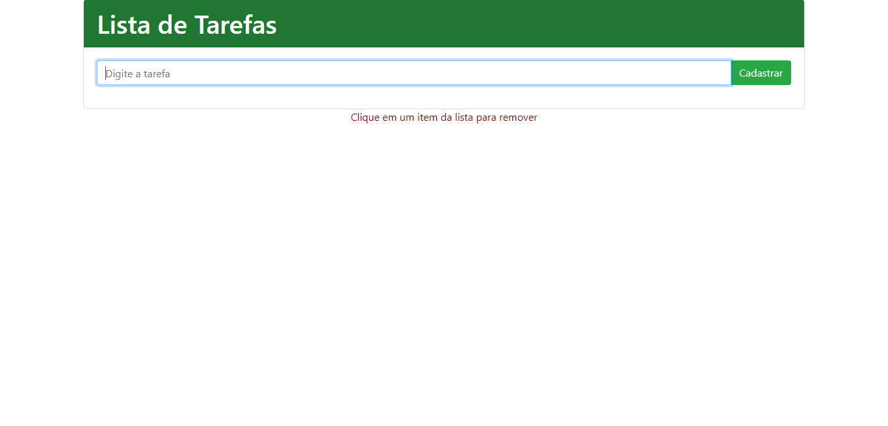

# Lista de Tarefas JS
## This page can create simple and responsive to-do lists using Vanilla JS, in wich you can create and delete new itens that are saved in your browser's local storage

**Initial page** 

 
 **List with items** 

**Tools used**
- Vanilla JS
- HTML
- Bootstrap
- CSS

**Future implementations:**
- [ ] Make the list reordable
- [ ] Add time / date for the items

 ___Observation:___
 Most elements and comments are in portuguese to reach the brazilian/portuguese dev. community more easily.
